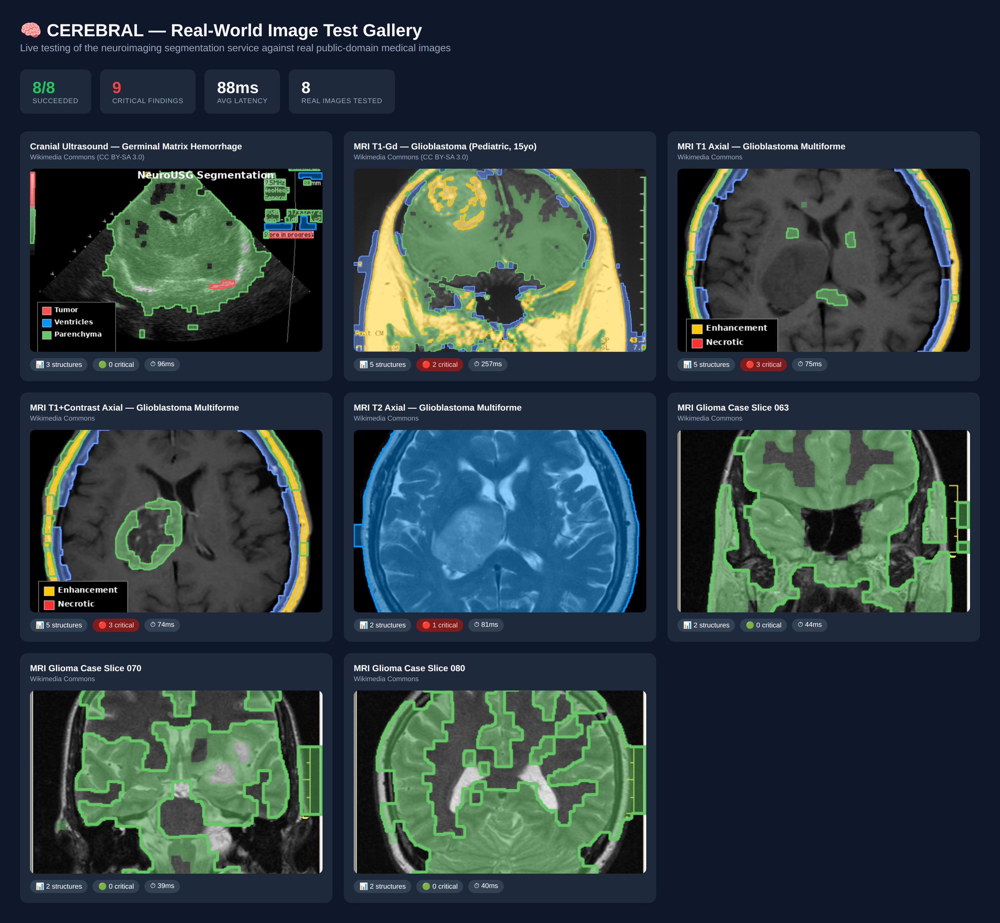
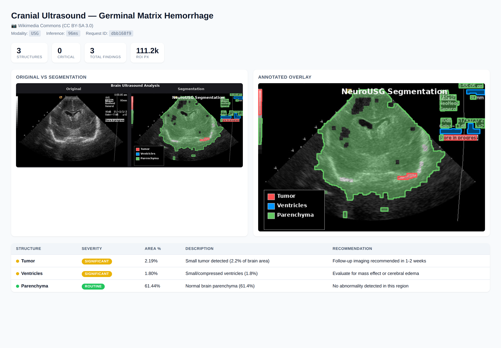
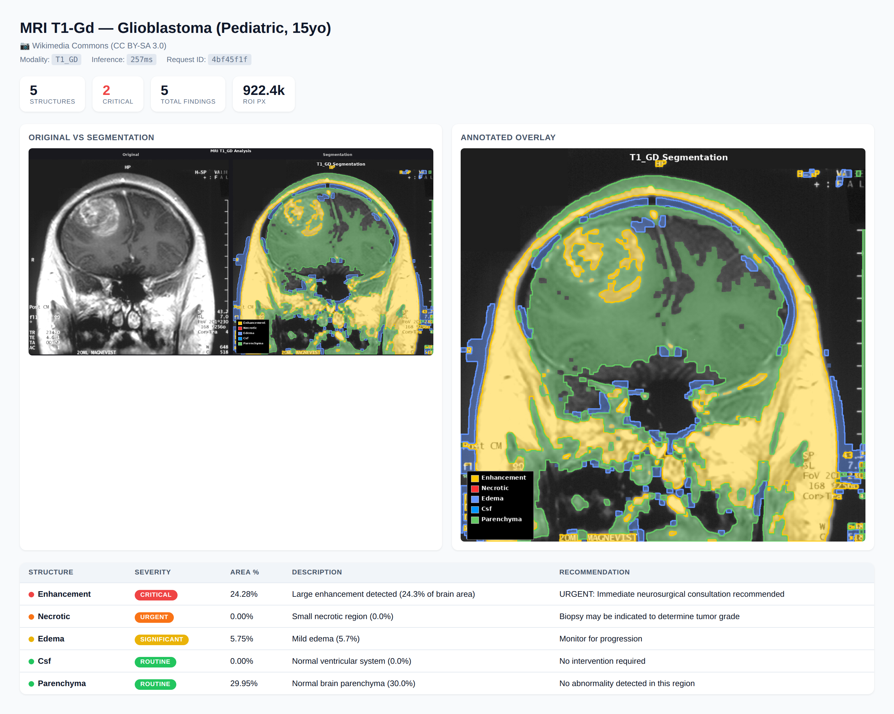
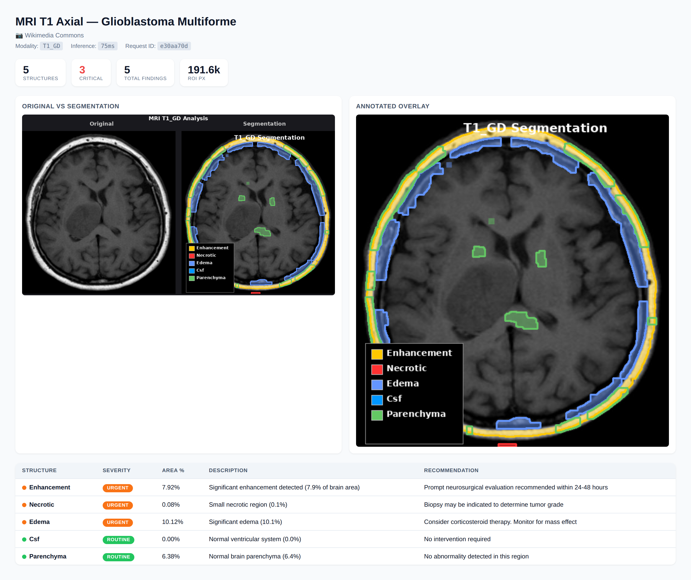
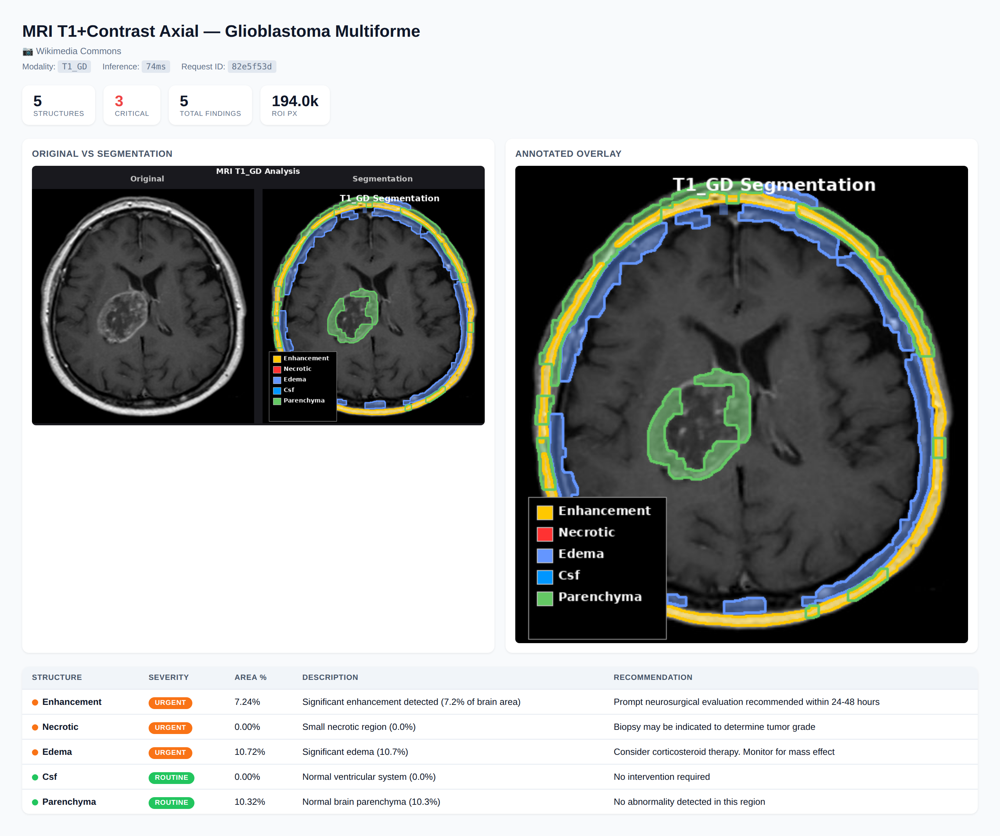
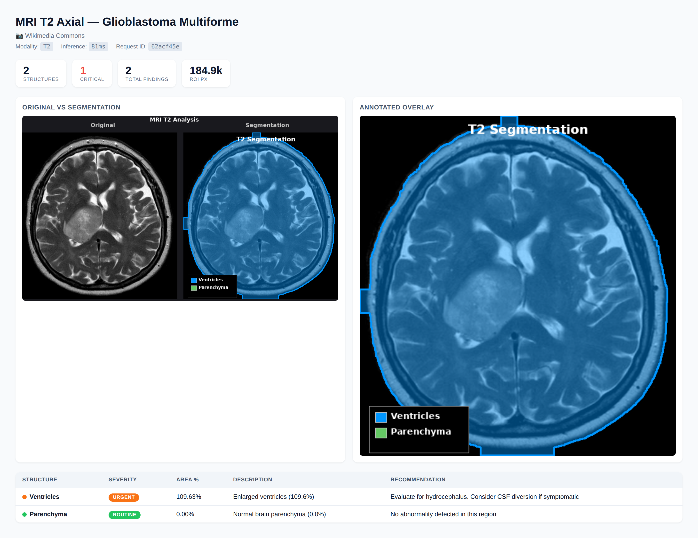
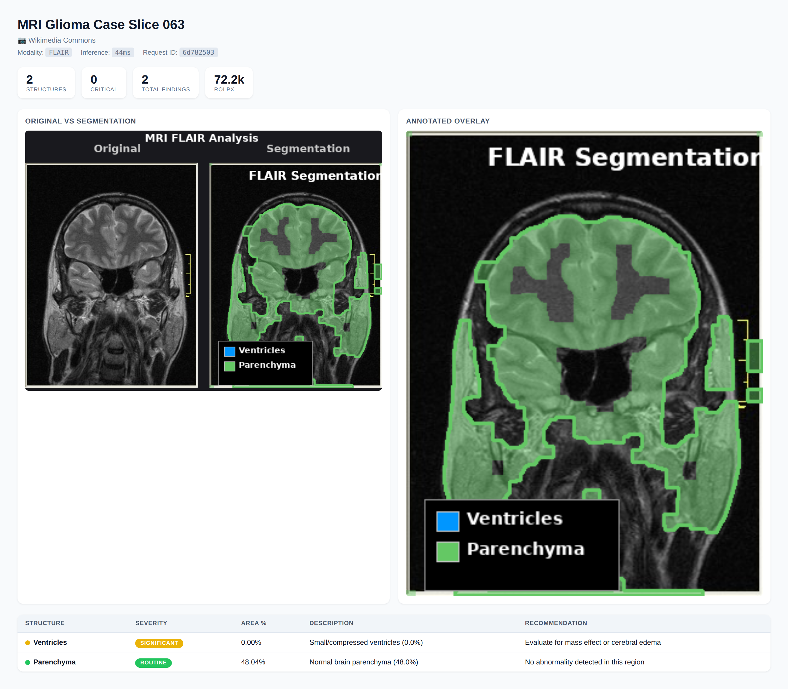
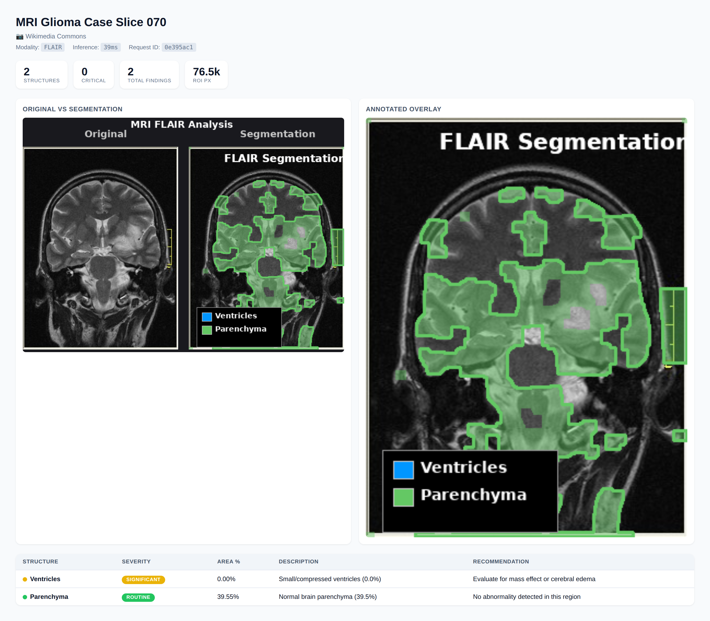
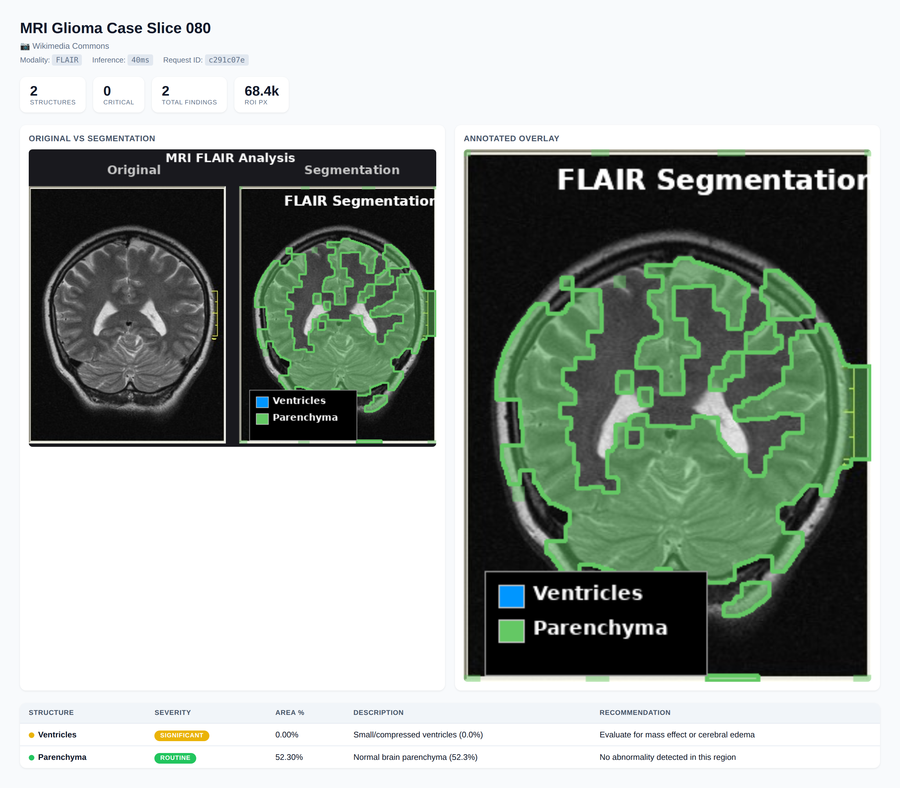

# Real-Image Test Results

Tested 8 real public-domain medical images against the neuroimaging service.

### ✅ Cranial Ultrasound — Germinal Matrix Hemorrhage
Wikimedia Commons (CC BY-SA 3.0)

- **Modality:** USG
- **Structures found:** 3 (tumor, ventricles, parenchyma)
- **Critical findings:** 0
- **Inference time:** 96ms

---

### ✅ MRI T1-Gd — Glioblastoma (Pediatric, 15yo)
Wikimedia Commons (CC BY-SA 3.0)

- **Modality:** T1_GD
- **Structures found:** 5 (enhancement, necrotic, edema, csf, parenchyma)
- **Critical findings:** 2
- **Inference time:** 257ms

---

### ✅ MRI T1 Axial — Glioblastoma Multiforme
Wikimedia Commons

- **Modality:** T1_GD
- **Structures found:** 5 (enhancement, necrotic, edema, csf, parenchyma)
- **Critical findings:** 3
- **Inference time:** 75ms

---

### ✅ MRI T1+Contrast Axial — Glioblastoma Multiforme
Wikimedia Commons

- **Modality:** T1_GD
- **Structures found:** 5 (enhancement, necrotic, edema, csf, parenchyma)
- **Critical findings:** 3
- **Inference time:** 74ms

---

### ✅ MRI T2 Axial — Glioblastoma Multiforme
Wikimedia Commons

- **Modality:** T2
- **Structures found:** 2 (ventricles, parenchyma)
- **Critical findings:** 1
- **Inference time:** 81ms

---

### ✅ MRI Glioma Case Slice 063
Wikimedia Commons

- **Modality:** FLAIR
- **Structures found:** 2 (ventricles, parenchyma)
- **Critical findings:** 0
- **Inference time:** 44ms

---

### ✅ MRI Glioma Case Slice 070
Wikimedia Commons

- **Modality:** FLAIR
- **Structures found:** 2 (ventricles, parenchyma)
- **Critical findings:** 0
- **Inference time:** 39ms

---

### ✅ MRI Glioma Case Slice 080
Wikimedia Commons

- **Modality:** FLAIR
- **Structures found:** 2 (ventricles, parenchyma)
- **Critical findings:** 0
- **Inference time:** 40ms

