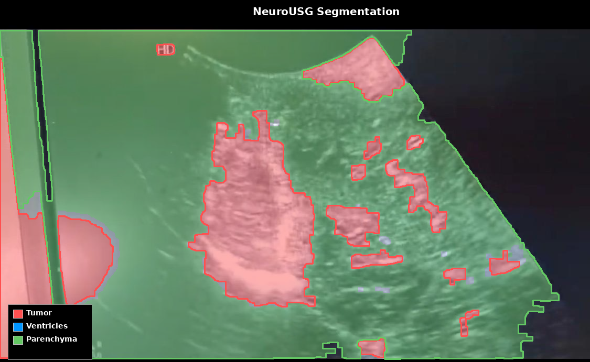
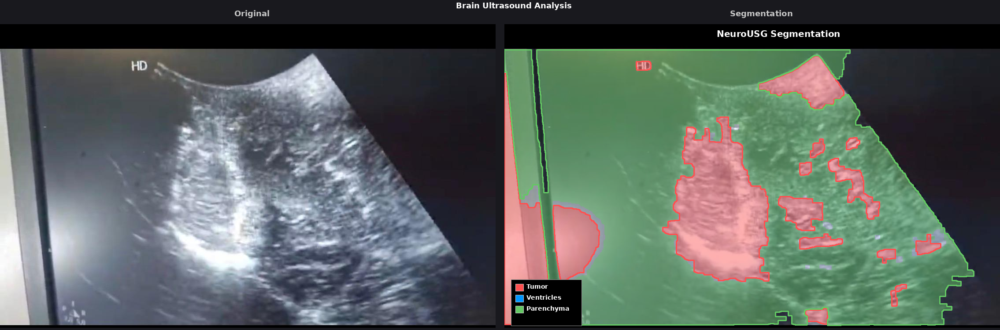
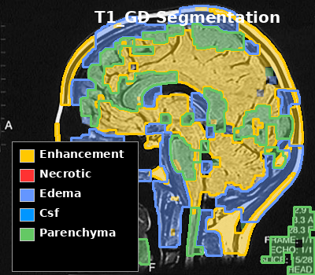
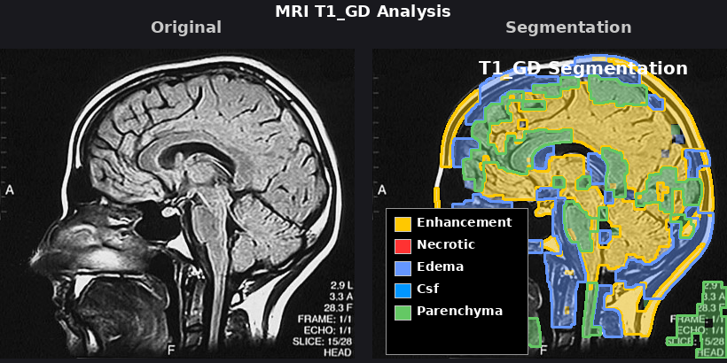

# CEREBRAL UI Screenshots

Visual documentation of the CEREBRAL neuroimaging segmentation app.
Captured at 2x device pixel ratio for retina-quality docs.

| Viewport | Width × Height |
|----------|----------------|
| Mobile (iPhone 14 Pro) | 390 × 844 |
| Desktop | 1440 × 900 |

## 🖼️ Application Screens

### 1. Home Screen
The landing page with quick access to import, 3D viewer, model comparison, and test samples.

| Mobile | Desktop |
|--------|---------|
|  |  |

### 2. Datasets
Browse and load MRI samples from HuggingFace datasets.

| Mobile | Desktop |
|--------|---------|
|  |  |

### 3. History
View previously saved analyses.

| Mobile | Desktop |
|--------|---------|
|  |  |

### 4. ML Settings
Configure ML backend service URLs and check service health.

| Mobile | Desktop |
|--------|---------|
|  |  |

### 5. Analysis — NeuroUSG (Brain Ultrasound)
Tumor, ventricle, and parenchyma segmentation from brain ultrasound images.

| Mobile | Desktop |
|--------|---------|
|  |  |

### 6. Analysis — NeuroMRI (T1-Gd / T2 / FLAIR)
Enhancement, necrosis, edema, CSF, and parenchyma segmentation.

| Mobile | Desktop |
|--------|---------|
|  |  |

### 7. Analysis — UNet (Lesion Detection)
Hyperintense lesion detection with severity classification.

| Mobile | Desktop |
|--------|---------|
|  |  |

### 8. Analysis — SynthSeg (Brain Volumetrics)
32-structure FreeSurfer-compatible brain volume analysis.

| Mobile | Desktop |
|--------|---------|
|  |  |

### 9. Interactive Segmentation — MedSAM2
Point/box-prompted segmentation for precise region selection.

| Mobile | Desktop |
|--------|---------|
|  |  |

### 10. Model Comparison
Side-by-side comparison of all ML model outputs on the same image.

| Mobile | Desktop |
|--------|---------|
|  |  |

---

## 🧠 Neuroimaging Segmentation Output

Real results from the production neuroimaging service (port 5010).

### A. NeuroUSG — Brain Ultrasound Segmentation
3 structures detected · 1 critical finding (large tumor 18.5%)


| Annotated Overlay | Side-by-Side Comparison |
|-------------------|-------------------------|
|  |  |

### B. MRI T1-Gd Segmentation
5 structures detected · 3 critical findings (enhancement, edema, mass effect risk)


| Annotated Overlay | Side-by-Side Comparison |
|-------------------|-------------------------|
|  |  |

### C. MRI FLAIR Segmentation
Edema and parenchyma analysis — no critical findings on test sample


---

## 🔬 Severity Color Reference

| Color | Severity | Clinical Meaning |
|-------|----------|------------------|
| 🔴 Red `#EF4444` | **CRITICAL** | Life-threatening, urgent action required |
| 🟠 Orange `#F97316` | **URGENT** | Prompt attention within 24–48 hours |
| 🟡 Yellow `#EAB308` | **SIGNIFICANT** | Follow-up imaging recommended |
| 🟢 Green `#22C55E` | **ROUTINE** | Normal finding, routine monitoring |

## 🔄 Regenerating Screenshots

```bash
# Make sure Expo (8081) and neuroimaging service (5010) are running
npm run dev

# In another terminal:
node scripts/capture-screenshots.js          # UI screens (20 images)
node scripts/capture-segmentation-output.js  # Segmentation reports (8 images)
```
